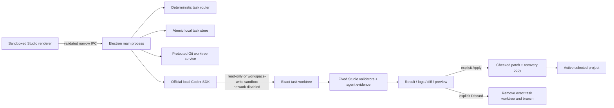

# Phase 2B architecture — Codex AI Workspace

## Outcome

Crownlands Studio now has a first-class Codex AI area that converts a development request and selected Studio context into a classified, plan-first task. Review Only runs against the selected project with a read-only Codex sandbox. Safe Edit and Full Development create an isolated Git worktree/branch, run a local Codex SDK thread there, collect evidence, and wait for the user to apply or discard the complete task.

The implementation extends the Phase 1 Electron and editor architecture. It does not replace World, Balance, UI Studio, HUD Layout, QA, project selection, protected writes, backups, dirty-state protection, logs, or the local server.

## Trust and data flow

The renderer never receives a filesystem path API, shell, Git command, child process, SDK instance, environment, or unrestricted IPC channel. Preview uses a trusted read-only static server; it never imports AI-modified code into Electron's privileged main process.

The integration is built on the official [Codex SDK](https://learn.chatgpt.com/docs/codex-sdk), including local thread start/resume, streamed task events, image input, and read-only/workspace-write sandboxes. Worktrees follow the isolation model described in the official [Codex worktree guidance](https://learn.chatgpt.com/docs/environments/git-worktrees), while task-local instructions follow [AGENTS.md guidance](https://learn.chatgpt.com/docs/agent-configuration/agents-md).

## Modules

- `tools/crownlands-studio/ai/ai-workspace-service.js`: orchestration and task lifecycle.
- `task-router.js`: deterministic classification, complexity/risk assessment, agent/role routing, plan, and future-ready subtask graph.
- `constants.js`: agent profiles, permission/status values, and role-to-model defaults.
- `ipc-schema.js`: strict task/action/settings validation and bounded serializable context.
- `git-worktree-service.js`: exact branch/worktree boundaries, diff, clean-state checks, checked apply, and discard.
- `codex-runner.js`: official SDK adapter, thread streaming/resume, secret-minimized environment, sandbox settings, cancellation, and redacted evidence.
- `validation-service.js`: fixed, non-user-controlled validation commands.
- `task-store.js`: persistent atomic history and interrupted-run recovery.
- `preview-server.js`: GET/HEAD-only task preview with CSP and project-root confinement.
- `tools/map-editor/codex-ai.js`: renderer state and review UI using only the preload API.

## Task lifecycle

1. `Plan Task` validates the payload, optionally adds the active diff summary, runs deterministic classification/routing, and persists a plan.
2. If screenshot context is requested, Electron captures the current Studio window and stores it in the local AI attachment directory.
3. Review Only starts a read-only SDK thread in the active project.
4. Edit modes first require no unsaved Studio state and a clean active Git worktree, then create `codex/studio-task-<task-id>` in the protected task-worktree root.
5. Codex receives the repository `AGENTS.md`, specialized profile, task plan, selected context, and explicit production restrictions. Network is disabled and approval mode is `never`; no privilege escape is available to the renderer.
6. Completed SDK events are redacted and persisted. Agent test commands are recorded as evidence.
7. Studio independently runs `git diff --check`, JavaScript syntax checks, and the Studio regression suite when relevant. An edit-mode task with no reviewable Git diff is a failure, even if the SDK turn itself completed.
8. The user reviews files, diff, evidence, logs, and a read-only visual preview.
9. Apply requires the active project to be clean, at the task's base commit, and free of unsaved Studio edits. Studio saves a recovery patch, verifies `git apply --check`, then applies the full task patch without commit/merge/push.
10. Discard removes only the validated task worktree and its exact prefixed branch.

## Persistence

Development-local files are ignored by Git:

- `.crownlands-studio/ai/tasks.json`
- `.crownlands-studio/ai/attachments/<task-id>.png`
- `.crownlands-studio/ai/patches/<task-id>.patch`

Task records include timestamps, prompt/context, routing, permission, plan, branch/worktree/base commit, status, files, tests, usage when exposed, failure/retry evidence, and apply/discard state. A task left `running` during shutdown is recovered as `failed` on relaunch with its worktree preserved.

## Windows package runtime

Electron Builder places the Windows x64 Codex vendor tree under `resources/codex-runtime/`. The SDK receives an explicit executable path plus the packaged `codex-path` tool directory. This short resource layout keeps the sandbox helper below legacy Windows process-path limits; native binaries are never spawned from inside `app.asar`.

## Future-ready boundary

High-complexity plans include expandable subtask/dependency metadata and parallel-safety flags. Phase 2B intentionally executes one lead SDK thread per parent task. Later orchestration can schedule those nodes without changing the task, routing, persistence, IPC, or review schema.
