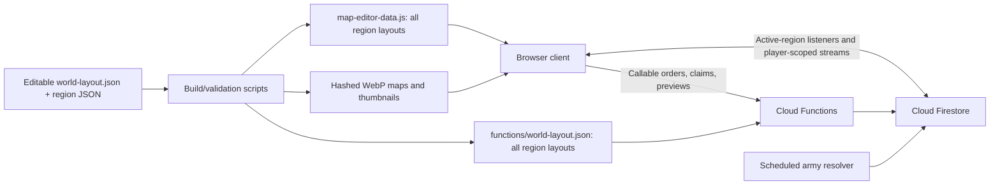

# Crownlands current map architecture

Audit date: 2026-08-13

Audited revision: `6ce0d48` (`origin/main`)

Scope: read-only architecture and scaling audit; no production behavior was changed.

## Executive summary

Crownlands is a browser-rendered, region-partitioned world backed by Firebase. The runtime displays one region at a time, subscribes only to that region's cities, camps, and active armies, and keeps combat and arrival resolution authoritative in Cloud Functions. Those are sound foundations for scaling.

The main architectural contradiction is that the runtime is region-scoped but its catalog and static data are not. Every client synchronously loads the expanded layout for all 15 regions and all 1,050 city definitions, while the server embeds the same complete layout at deploy time. Adding regions therefore increases boot payload and deployment coupling even though gameplay only needs one region. New-player initialization also seeds every starter region, making account creation scale with the number and size of starter regions.

## System shape

## World and region layout

The editable catalog is `assets/worlds/world_01/world-layout.json`, with one JSON document per region under `assets/worlds/world_01/regions/`. The production build generates two expanded copies:

- `assets/map-editor-data.js`, loaded synchronously by the browser before `game.js`: 350,214 bytes.
- `functions/world-layout.json`, loaded by Cloud Functions at process startup: 350,177 bytes.

`world-config.js` still describes the original five-island world and a fixed 13,000 × 17,000 coordinate space. `game.js` merges it with the generated editor data. Compatibility constants for the five original regions, map assets, polygons, and terrain remain in the runtime.

The current catalog contains 15 regions, 1,050 cities, five objective markers, and four camp markers:

| Grid | Region | Type | Cities | Special marker |
|---:|---|---|---:|---|
| 0,0 | `crownlands_main` | center | 102 | objective |
| -1,0 | `west_island` | endgame | 61 | objective |
| 1,0 | `east_island` | endgame | 65 | objective |
| 0,-1 | `north_island` | endgame | 70 | objective |
| 0,1 | `south_island` | endgame | 57 | objective |
| -2,2 | `region_6` | midgame | 49 | camp |
| -1,2 | `region_7` | midgame | 71 | camp |
| 0,2 | `region_8` | midgame | 93 | — |
| 1,2 | `region_9` | midgame | 80 | deed camp |
| 2,2 | `region_10` | midgame | 39 | camp |
| -2,3 | `region_11` | starter | 79 | — |
| -1,3 | `region_12` | starter | 74 | — |
| 0,3 | `region_13` | starter | 76 | — |
| 1,3 | `region_14` | starter | 61 | — |
| 2,3 | `region_15` | starter | 73 | — |

The edge catalog has 36 directed connections, representing 18 reciprocal links. All current links are reciprocal. Region metadata defaults to 2,048 × 1,536 but the active raster maps are 1,448 × 1,086. Computed world bounds range from 2,582 × 1,937 for most added regions up to 4,636 × 3,477 for the center.

`cityCapacity` is currently advisory metadata, not an enforced storage or spawn limit. Most regions declare 50 and two declare 100, while many actual city counts exceed those values. Capacity must be given one authoritative meaning before it can drive dynamic expansion.

### Edges, roads, and exits

Each region JSON contains `edgeConnections.north/south/east/west`. An empty array is effectively a closed edge; a connection object is an open crossing zone. Across 15 regions there are 60 edge sides: 36 have one connection and 24 are closed. All 36 current connections are type `road`, point to a `connectsToRegionId`, and have `intentionalOuter: false`.

An open zone stores normalized `start`/`end` extents along the edge and a normalized arrow position used by map navigation. The edge is an invisible troop-crossing area; the background art supplies the visible road. There are no portals—the editor documentation explicitly directs authors to use edge zones. The route validator ensures the current region graph connects, while the canonical route planner converts edge zones and region bounds into cross-region path segments. Reciprocity exists in current data but must remain a publishing validation rule.

### Cities, camps, Strongholds, and Citadel

Editable entity positions use normalized `xNorm`/`yNorm` coordinates relative to the region image. The generated browser/server manifests convert those to image-space points and then to the fixed world coordinate space for live rendering, route calculation, and Firestore seed documents. Runtime DOM positions are pixel/world coordinates relative to the active map bounds.

Normal cities are manually placed in Region Edit. The editor displays scaled marker/label footprints and highlights overlaps. IDs are explicit strings such as `center_001`; current files follow region-prefix conventions, but identity is not generated dynamically at runtime. Camps are separate typed markers (`gold`, `troops`, `items`, or `deed`) with normalized position, art, size, and optional reward overrides.

Five `strongholds` entries are transformed into runtime objective cities:

- `center_crown_citadel` in `center`, Level 100, crown type.
- `west_gold_stronghold`, `north_training_stronghold`, `east_speed_stronghold`, and `south_defense_stronghold`, Level 50.

Their IDs, bonuses, sizes, and several behaviors are also explicitly enumerated in client/server constants. The Crown Citadel has additional reign, bonus, and NPC-assault logic bound to `center`. Generated expansion can add typed objectives only after these ID-specific rules are moved into validated metadata.

### Terrain blockers

Terrain blockers are not stored in the 15 editable region JSON files. Client and server instead duplicate pixel ellipses for the five legacy regions in `game.js` and `functions/authoritative-route-policy.js`: 15 authoritative route-blocking ellipses total (west 3, north 3, east 3, south 2, center 4). The client has additional no-city ellipses and legacy world-terrain shapes for forests, swamps, mountains, and clearings.

The canonical route engine tests points/segments against rotated image ellipses. Added regions currently receive no equivalent data-driven blocker set. This is a major generator requirement: the static layout must publish separate authoritative route blockers and no-city masks that match the painted terrain, with one validated server/client source.

### Editor and generated files

`tools/map-editor/` is a developer-only manual editor, not a procedural generator. It edits the square world grid; uploads 4:3 JPG/PNG/WebP region art; places cities, Strongholds, camps, and edge zones; and writes the source JSON plus `assets/map-editor-data.js`. The editor can add a grid tile without assuming 15 in its UI, but deployment still regenerates and ships the complete catalog.

The thumbnail pipeline does not derive thumbnails from the full map automatically. Authors provide `*-thumb.webp` files; `tools/fingerprint-world-thumbnails.js` copies them to content-hashed names, rewrites references, and writes `thumbnail-manifest.json`. That tool currently contains an explicit `entries.length !== 15` assertion and a filename pattern geared to current/numbered IDs, so it is a direct expansion blocker.

## Asset loading

Each region uses one baked WebP map plus a WebP thumbnail. The active full-resolution set totals 8,927,742 bytes (8.51 MiB); individual files are 444–677 KiB and pass the existing 750 KiB budget. The 15 thumbnails total 391,236 bytes (0.37 MiB).

On region entry, `game.js` loads and decodes the active map at high priority, validates its expected dimensions, then replaces the map image. After three idle seconds it sequentially preloads at most two graph neighbors at low priority. Neighbor preloading is skipped when the page is hidden, data saver is enabled, or a 2G connection is reported. The region picker creates all 15 thumbnail elements when opened, using lazy loading, asynchronous decoding, and low fetch priority.

The application does not preload every full-size map. That is a meaningful strength: normal map-image cost is approximately one active decoded raster, with at most two neighbors warmed opportunistically.

## Browser boot path

`index.html` currently references 18 synchronous local script positions, including one generated release manifest at deployment. The 17 present script files total 2,336,573 raw bytes. Five local stylesheets total 586,956 raw bytes, plus Google Fonts. Across the present HTML, scripts, and styles, the source payload is approximately 2.97 MB raw, 550 KiB by per-file gzip estimate, or 418 KiB by per-file Brotli estimate.

Four images are preloaded in the shell—login background, ring, crown, and transition clouds—for a combined 294,052 bytes. Firebase 10.12.5 modules for app, authentication, Firestore, Functions, and App Check are loaded dynamically; messaging is loaded later when needed.

The service worker uses network-first handling for HTML, JavaScript, CSS, and JSON, and cache-first handling for images. Its install precache is about 2.99 MiB against a 3 MiB validation budget, leaving only about 10 KiB of headroom. Content-hashed map assets are safely immutable, but the runtime image cache has no explicit LRU or quota policy.

Full regional map files and thumbnails are not manually enumerated in the install precache. They are discovered from the all-world client manifest and cached on first image request by a generic `/assets/worlds/` cache-first rule. Adding a map does not require adding its file to `STATIC_CACHE_URLS`, but it does currently require regenerating/deploying the manifest and versioned assets. JSON is network-first; image failures for world maps deliberately surface instead of returning the generic placeholder, allowing the client to keep the prior region visible.

## Map rendering model

The renderer is DOM/SVG-based:

- One raster `` provides the region background.
- Cities, camps, army tokens, labels, and interaction controls are keyed DOM nodes.
- March routes are SVG paths and are rebuilt only when their signature changes.
- `.map-world` is transformed for pan and zoom, with `contain: layout style`.
- `will-change` is enabled only while panning, dragging, or zooming.

Cities and camps are culled outside the viewport with a 420 screen-pixel margin. Army tokens use a 240-pixel margin. Nodes are reused when still visible and removed when outside the cull area; new nodes are appended through a document fragment.

Pan and zoom transforms are coalesced through `requestAnimationFrame`. Expensive map, path, and city updates are deferred during interaction and resume after a 180 ms pan-settle or 260 ms zoom-settle window.

The application has performance-oriented LOD states:

- Low zoom enters at `<= 0.72` and exits at `>= 0.78`.
- Crowded mode enters at 70 visible cities or 24 armies and exits at 58 cities or 18 armies.

These modes reduce filters, shadows, and infinite path effects. They do not reduce the number of entities or labels, so they are visual-cost controls rather than semantic LOD. At a sufficiently low zoom—especially on a mobile viewport—the culling margin can include most or all of a region.

## Simulation and animation cadence

A single continuous animation frame loop drives the main client clock. Work is rate-limited within that loop:

| Work | Cadence |
|---|---:|
| Simulation | 100 ms (10 Hz) |
| Army token rendering | 140 ms (~7.1 Hz) |
| HUD | 250 ms |
| City text | 600 ms |
| HUD status | 1 s |
| General map render | 1.6 s |

The animation manager caps simultaneous effects at 14 and particles at 64, with separate world/UI/transition limits, duplicate suppression, and cleanup watchdogs. It supports full, reduced, and off modes and honors reduced-motion preferences. The main CSS files define 73 keyframe blocks and 30 declarations containing infinite animations. Camera movement, low zoom, and crowded mode suppress the expensive route-flow effect, but the stylesheet still contains several independent infinite UI effects.

Not every timer is centralized. Presence and heartbeat work runs around 60 seconds; economy refresh runs around 120 seconds; modal, clan, daily, seasonal, reward, cleanup, and debounce timers are lifecycle-scoped in their respective modules. The main world simulation and rendering work is centralized, while background/product timers are distributed.

## Realtime model

The active region establishes four principal streams:

1. All city documents for the active island.
2. All camp documents for the active island.
3. Active armies projected into the active island.
4. Realm-scoped recent presence, capped at 200 records and rebound approximately every minute.

Switching region unsubscribes the prior streams and increments a generation guard so late callbacks are ignored. The client does not hold world-wide city, camp, or army listeners.

Global gameplay state adds player-scoped outgoing armies, private incoming projections, two stationed-reinforcement queries, held camps, recent reports (up to 120), realm activity (up to 250), global stats, and the crown-citadel document. A normal active game is roughly 13 live listeners before account/session and mission state; those commonly bring it to about 17. Clan, rally, social, quest, and application views can bring the session into the mid-20s.

This listener count is mostly constant as regions are added. The larger issue is document volume and refresh behavior: active-region city reads grow with region size, while presence can re-read up to 200 records each minute and realm activity is a global 250-record stream rather than a local-interest feed.

## Server authority and marches

Army orders and combat are server-authoritative:

- `previewArmyRoute` reads the source, target, profile, and stats in a transaction and returns an authoritative route and duration.
- `sendArmyOrder` validates source and target against the deployed manifest, rate-limits and deduplicates the request, deducts troops transactionally, computes the route/timing/combat snapshot, then writes the canonical army and its per-region projections.
- `resolveArmyOrderById` is idempotent, refuses early resolution, and resolves ownership, casualties, economy, reports, and notifications on the server.
- The client calls resolution at arrival, while a scheduled function scans the canonical root `armies` collection every minute as a backstop.

This protects combat integrity and avoids collection-group scans in the scheduler. The main future scaling cost is write amplification: a route projection is written for each region crossed, so very long routes increase Firestore writes and cleanup work.

## Spawn and region initialization

Cloud Functions derive starter regions dynamically from catalog type, which is preferable to a fixed list. However, a new-account claim currently calls `ensureMainIsland` for every starter region in parallel before choosing a destination. The five present starter regions contain 363 city documents in total. Adding starter regions makes new-player initialization linearly more expensive.

Each individual region is seeded through a lease-protected Firestore batch. A 100–150-city region fits below Firestore's 500-write batch ceiling, but the design has no safe path for arbitrarily larger regions or partial seed recovery. Region selection uses a `playerCount` summary, randomized ties, neutral-city selection, and reservation retries. When all starter regions fill, the current outcome is resource exhaustion; it does not provision or activate a standby region.

## What is already strong

- Rendering and most live data are scoped to one active region.
- Region transitions have unsubscribe and late-callback protection.
- Map imagery is hashed, dimension-validated, and loaded one region at a time.
- DOM nodes are keyed, reused, and viewport-culled.
- Pan/zoom work is frame-coalesced and expensive renders are interaction-deferred.
- Animation modes, effect caps, and crowded/low-zoom controls exist.
- Army creation, routing, timing, combat, and resolution are server-authoritative and idempotent.
- The scheduled army resolver uses the canonical collection and bounded pagination.

## Architectural constraints to remove next

1. Replace the synchronous all-region client layout with a small catalog and lazy region documents.
2. Replace the deploy-embedded server manifest with a versioned, validated region catalog that can activate data without a full client/functions release.
3. Remove legacy five-region runtime fallbacks after compatibility data has moved into catalog metadata.
4. Make region lifecycle, capacity, neutral supply, layout version, and asset version authoritative.
5. Seed and claim only the selected starter region; pre-generate standby regions instead of ensuring every starter region per account.
6. Add semantic LOD and bounded activity/presence interest management before substantially increasing per-region density.

See [DYNAMIC_REGION_READINESS.md](./DYNAMIC_REGION_READINESS.md) for the expansion gap analysis and [RECOMMENDED_PHASES.md](./RECOMMENDED_PHASES.md) for a staged migration.
