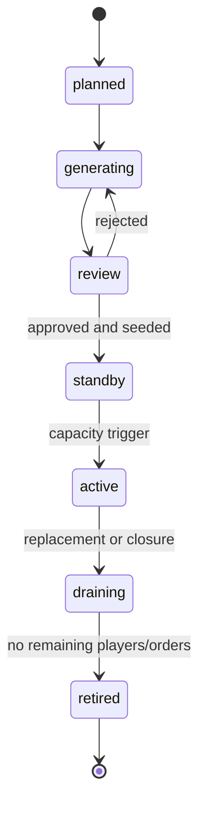

# Dynamic region readiness

Audit date: 2026-08-13

Target considered: 60+ regions, approximately 100–150 cities per region, with controlled automatic expansion.

## Readiness verdict

Crownlands is structurally region-aware but not yet dynamically provisionable. Rendering, Firestore collections, graph routing, and most selectors use region IDs and can accept additional catalog entries. However, region data is compiled into every client and Cloud Functions deployment, world bounds and several legacy behaviors are fixed, starter seeding is account-coupled, and there is no authoritative region lifecycle or activation service.

The system is suitable for manually adding more regions through the current build/deploy workflow. It is not suitable for safely creating and activating regions at runtime.

## Direct answers to expansion questions

| Question | Answer |
|---|---|
| Are region counts hard-coded? | The runtime generally derives length, but `tools/fingerprint-world-thumbnails.js` explicitly requires 15 thumbnails and current asset validation/build assumptions target the present set. |
| Are the current 15 map IDs explicitly enumerated? | The generated manifests enumerate all 15. General loops are data-driven, but the five legacy IDs and five special objective IDs are repeatedly explicit; current thumbnail cleanup patterns also assume legacy/numbered naming. |
| Does UI assume exactly 15 maps? | The picker iterates catalog data, so it can show a 16th. Its flat grid creates all tile elements at modal open and is not a usable/efficient 60+ region browser without virtualization and grouping. |
| Does pathfinding assume fixed topology? | Cross-region topology is data-driven through edge connections and route segments. Terrain blockers are hardcoded only for five legacy maps, server catalog is deploy-static, and fixed world bounds constrain new grid positions. |
| Does the database assume a fixed region count? | Firestore paths do not. Each island/region is a separate partition. Seeding, catalog trust, summaries, rules/index coverage, and activation operations are the limiting layers. |
| Does spawning assume fixed maps? | Starter IDs are derived by type, but the server ensures every starter region on new accounts and has no standby provisioning. The client also has a broader starter→midgame→endgame availability fallback than the authoritative claim service. |
| Do achievements/missions assume fixed map IDs? | Ordinary city/camp quest progress is event/type based and can be region-agnostic. Some special gameplay is ID/region-specific: Citadel/Stronghold IDs, center Citadel assault, and deed-camp exclusions. These require typed metadata and regression tests. |
| Do camps/Strongholds assume fixed regions? | Camps are typed, data-driven markers. Four resource Strongholds and the Crown Citadel are explicitly enumerated in client/server rules and occupy the five legacy regions. |
| Do thumbnails/navigation assume static maps? | Catalog-driven navigation can display additions, but the thumbnail fingerprint tool asserts exactly 15 and thumbnails are manually supplied. Flat picker and fixed world-grid presentation do not scale ergonomically. |
| Does PWA caching enumerate map files manually? | No full map/thumbnail list is precached; generic asset rules runtime-cache discovered URLs. Discovery still depends on the deployed all-world manifest, and the runtime cache has no quota/LRU. |

## Capability scorecard

| Capability | Current state | 60+ readiness |
|---|---|---|
| Region collection paths | Partitioned by island/region | Ready with budgets |
| Active-region listener scope | One region at a time | Ready |
| Region graph | Data-driven, reciprocal current links | Ready after validation/versioning |
| Server city/region lookup | Derived maps/sets from manifest | Ready in shape, static in deployment |
| Starter-type discovery | Derived from region type | Ready in shape |
| Region picker | Data-driven 15-tile grid | Needs virtualization/search at 60+ |
| Client static layout | All 1,050 cities in synchronous JS | Blocking |
| Server static layout | Whole world required at cold start | Blocking for runtime activation |
| World extent | Fixed 13,000 × 17,000 | Blocking outside current grid |
| Legacy special regions | Five-region constants and fallbacks | Migration required |
| Region lifecycle | No planned/generating/active state machine | Blocking |
| Capacity semantics | Advisory `cityCapacity`, often below actual count | Blocking |
| New-player spawn | Ensures all starter regions per account | Blocking |
| Standby activation | None; full starter set returns exhaustion | Blocking |
| Asset/runtime cache policy | Hashed assets, no bounded LRU | Needs work |

## What is already dynamic

- Client region arrays, lookup maps, picker coordinates, neighbor graph traversal, and map switching use catalog data.
- Server region/city maps and starter IDs are derived from the deployed layout.
- Firestore separates region city/camp/projection documents beneath region paths.
- Route planning uses the region graph instead of assuming only adjacent original islands.
- Builds fingerprint production map assets and validate region dimensions, links, and manifests.
- The active client does not subscribe to every region.

These are valuable seams. The migration should preserve them and change how catalog/layout data is delivered and activated.

## Blocking assumptions

### Complete world in every bundle

`assets/map-editor-data.js` contains all regions and all 1,050 city definitions and loads synchronously. `functions/world-layout.json` duplicates the expanded catalog for the server. At 60 regions × 100–150 cities, this becomes 6,000–9,000 city definitions in every client boot and every Functions process even though one region is active.

### Deploy-time activation

Functions validates city IDs and computes routes from a file imported at process startup. A newly generated region cannot become authoritative until Functions are rebuilt/deployed and instances refresh. Client assets/catalog also require a release. That is manual content deployment, not dynamic expansion.

### Fixed world geometry and legacy fallbacks

The merged world uses a fixed 13,000 × 17,000 extent and 2,300-unit grid cells. Expanding outside that designed grid risks clamping or overlap. The five original islands still have hardcoded identifiers, fallback assets, polygons, and terrain behavior. Some special objectives are intentionally hardcoded, such as the center/citadel and deed camp. Those exceptions must become typed catalog metadata rather than implicit ID branches.

### Spawn initializes every starter region

A new account currently ensures all five starter regions—363 city documents—before selecting a least-populated one. This is linear in the starter catalog and would make automatically adding capacity worsen every subsequent account creation. Seeding must be an administrative/worker lifecycle step, not a user request side effect.

### Region capacity is not authoritative

Most catalog entries declare a capacity of 50 while actual city counts exceed 50; two declare 100. Spawn logic relies on player count and neutral city availability instead. Before automation, define distinct fields:

- `cityCount`: immutable layout count.
- `claimableCityCount`: cities eligible for player spawn.
- `playerCapacity`: intended resident-player capacity.
- `neutralReserveTarget`: minimum neutral supply retained.
- `playerCount` and `neutralClaimableCount`: materialized live summaries.

## Proposed catalog boundary

Publish a small immutable world manifest containing only information needed before entering a region:

```json
{
  "worldId": "world_01",
  "catalogVersion": "sha256:…",
  "coordinateSystemVersion": 2,
  "regions": [
    {
      "regionId": "r_7f3a…",
      "displayName": "Bandit Wastes",
      "type": "starter",
      "lifecycle": "active",
      "grid": { "x": -2, "y": 3 },
      "bounds": { "width": 2582, "height": 1937 },
      "neighbors": ["r_…"],
      "layoutVersion": "sha256:…",
      "assetVersion": "sha256:…",
      "layoutUrl": "/worlds/world_01/regions/r_7f3a…/layout.hash.json",
      "mapUrl": "/worlds/world_01/regions/r_7f3a…/map.hash.webp",
      "thumbnailUrl": "/worlds/world_01/regions/r_7f3a…/thumb.hash.webp"
    }
  ]
}
```

The client downloads one small catalog, then lazily fetches the selected region layout and map. Immutable URLs allow long-lived CDN/service-worker caching. The active catalog version determines which layout and asset versions are legal.

For server trust, store an authoritative region registry such as `worlds/{worldId}/regions/{regionId}`. Functions may cache the active catalog, but requests must include or resolve its version and refresh when the registry's active catalog pointer changes. Activation should be server-controlled and atomic from the client's perspective.

## Region lifecycle

Use explicit states with narrow transitions:



Suggested registry fields include:

- Stable opaque `regionId`; never derive identity from display order or grid position.
- `lifecycle`, `type`, biome, difficulty, world/grid coordinates, and neighbor IDs.
- `layoutVersion`, `assetVersion`, `seedVersion`, and `catalogVersionActivated`.
- City, claimable, player-capacity, player-count, and neutral-count summaries.
- Generation seed, generator version, validation result, approval actor/time.
- `acceptsNewPlayers`, `acceptsTravel`, and maintenance flags.

Only approved `standby` regions may transition to `active`. Activation must atomically publish catalog membership, server validation data, graph edges, asset URLs, and spawn eligibility. Never expose a region whose assets, static layout, or Firestore seed are incomplete.

## Stable identity and versioning

Avoid sequential IDs such as `region_16` for new content; they couple identity to ordering and make merges/copying error-prone. Use stable opaque IDs and keep human-readable slugs as mutable aliases. Preserve the existing 15 IDs indefinitely through an alias table.

City IDs also need stable generation from region ID plus deterministic feature identity, not array position. Layout changes should generally publish a new `layoutVersion`; do not silently move a live city's coordinates under the same version. Asset and layout files use content hashes. The catalog itself is versioned and previous versions remain readable during rollout and rollback.

## Spawn redesign

New-player spawn should be constant-cost with respect to total world size:

1. Query a small server-maintained index of active starter regions with available neutral supply.
2. Select among the least-loaded candidates using reservations and randomized ties.
3. Transactionally reserve and claim one neutral city in the selected region.
4. Return the catalog/layout version required by the client.

Region seeding happens before activation through a worker. It should be resumable and chunked below Firestore batch limits, recording `seedVersion`, progress, and a completion checksum. Client-triggered `ensureMainIsland` may remain temporarily as an idempotent compatibility check for the selected region, but it must not seed every starter region.

Maintain at least one approved and seeded standby starter region. Trigger activation before exhaustion, for example when active starter regions exceed 75% player capacity or neutral claimable supply falls below a 20% reserve. Use hysteresis and a cooldown so normal churn does not repeatedly activate capacity.

## Region picker and navigation

Fifteen lazy thumbnails are acceptable. Sixty or hundreds need:

- Virtualized rendering and thumbnail fetches only for visible/near-visible rows.
- Search/filter by type, biome, ownership, clan presence, and reachable state.
- A graph/cluster overview rather than one enormous flat grid.
- Neighbor summaries loaded with the current region; full layout only on entry.
- Explicit unavailable/generating/draining states.

World coordinates should migrate to an extensible coordinate system. Region-to-region routing depends on graph edges; it should not require all maps to fit one fixed pixel rectangle. If a visual overview uses grid coordinates, compute its extent from the catalog rather than clamping to a legacy constant.

## Backward-compatible migration

1. Generate the new manifest and per-region layout files from the current source without changing IDs or gameplay.
2. Teach the client to prefer lazy layouts while retaining the old embedded object behind a release flag.
3. Teach Functions to read a versioned materialized catalog generated from the same source, with the current file as rollback.
4. Add registry/lifecycle documents for the existing 15 regions and mark them active only after parity validation.
5. Move hardcoded original-region behavior into typed metadata while retaining legacy aliases.
6. Move seeding out of account creation and pre-seed a standby region in a non-production exercise.
7. Activate one manually generated region through the new lifecycle before automating capacity triggers.

Rollback is catalog-pointer rollback, not deletion. Existing active orders retain the catalog/route version used at creation, and retired layouts remain readable until all dependent armies, reports, and migrations expire.

## Definition of dynamic-ready

Crownlands is dynamically ready when all of the following are proven:

- Client boot size and parse work do not increase materially when a region is added.
- Functions accept a newly activated, server-approved catalog version without a full application deployment.
- New-player claim work is bounded to one selected region.
- A region can be generated, validated, seeded, approved, activated, drained, and rolled back with an audit trail.
- Static layout and mutable live state are separate and versioned.
- Picker and caches remain bounded with at least 60 regions.
- Active gameplay listener/read volume depends on the current region and player interests, not total region count.
- Existing 15 region/city IDs and in-flight armies survive migration.

See [MAP_GENERATOR_PLAN.md](./MAP_GENERATOR_PLAN.md) for the content pipeline and [RECOMMENDED_PHASES.md](./RECOMMENDED_PHASES.md) for delivery order.
