# Map generator and dynamic expansion plan

Audit date: 2026-08-13

Status: architecture plan only; no generator or production migration was implemented.

## Recommendation

Build a deterministic, offline/admin map-generation pipeline that produces the same class of artifacts the game already consumes: a baked region raster, a compact static layout, a thumbnail, and validated metadata. Generation should run in a controlled worker or build environment, followed by automated checks and human approval. The runtime client should only consume approved, immutable artifacts.

Do not generate full maps in the browser. Runtime generation would make results device-dependent, compete with gameplay CPU/GPU/memory, complicate anti-cheat and reproducibility, and create asset/version mismatch between clients and Cloud Functions.

## Goals and non-goals

Goals:

- Produce playable 100–150-city regions with deterministic outputs from a seed and generator version.
- Preserve Crownlands' illustrated map style by composing curated art offline.
- Guarantee connectivity, spacing, route, spawn, camp, and objective constraints before review.
- Publish immutable, content-addressed assets and layout JSON.
- Pre-seed and approve standby capacity before activation.
- Make every generation and activation auditable and reversible.

Non-goals:

- Procedurally synthesize live gameplay in the client.
- Automatically activate unreviewed art or topology.
- Replace the existing editor; generated regions should be editable before approval.
- Modify active-region city coordinates in place.
- Make battle rules depend on decorative pixels.

## Pipeline

```mermaid
flowchart LR
    A["Region request: type, biome, difficulty, capacity"] --> B["Choose deterministic seed"]
    B --> C["Generate terrain mask and landmarks"]
    C --> D["Place cities, objectives, camps, portals"]
    D --> E["Build roads/routes and gameplay graph"]
    E --> F["Compose raster from curated modules"]
    F --> G["Export layout, map, thumbnail, diagnostics"]
    G --> H["Automated validation and simulated traversal"]
    H -->|fail| C
    H -->|pass| I["Editor and human art/gameplay review"]
    I -->|revise| C
    I -->|approve| J["Upload immutable assets and registry metadata"]
    J --> K["Chunked Firestore seed into standby region"]
    K --> L["Verify checksum and smoke test"]
    L --> M["Eligible for atomic activation"]
```

Every stage records its inputs, generator version, output hashes, duration, warnings, and actor. The output should be reproducible bit-for-bit where practical; image encoders and dependencies are pinned.

## Generator inputs

A generation request should specify constraints, not exact placements:

- `worldId`, stable `regionId`, region type, biome/archetype, and difficulty band.
- Target city range, claimable-city range, player capacity, and neutral reserve target.
- Required objectives, camps, portals, entry/exit edges, and special landmarks.
- Neighbor connections and their portal/edge approach directions.
- Region dimensions and safe UI margins.
- Art palette/module-set version and generator version.
- Optional narrative tags, handcrafted anchor placements, and exclusion zones.
- Deterministic seed.

The generated output includes a resolved configuration with every default made explicit. Re-running an old seed under a new generator version creates a new layout version; it never silently replaces the old output.

## Crownlands generation rules

These constraints should be encoded as validator rules, not left only to visual review:

| Rule | Required enforcement |
|---|---|
| Open and closed edges | Exactly one intentional road exit/crossing zone for each configured open edge in the initial generator; no road exit or navigable zone on a closed edge. Future multi-exit designs require a schema/rule version. |
| Reciprocal adjacency | Every connection names an active/standby neighbor with a reciprocal compatible edge, travel direction, and matching topology version. |
| Believable roads | Roads connect cities/objectives/edge exits, do not cross blocked water/mountains without a bridge/ford/causeway, and do not terminate visually without gameplay meaning. |
| Runtime city space | Preserve enough walkable, visually quiet placement area for the target 100–150 cities, label footprints, selections, and future claims. |
| Objectives and camps | Do not paint fake objective circles, camps, Strongholds, Citadels, or interactive buildings into the background. Publish typed runtime entities and render their approved art separately. |
| Terrain authority | Painted blockers and authoritative route/no-city masks come from the same generation inputs and pass overlay comparison. Decorative terrain that looks impassable cannot remain silently walkable. |
| Scale and camera | Use the approved 4:3 stage, marker scale, road width, texture scale, lighting/camera angle, safe margins, and zoom previews. |
| Visual identity | Use only approved Crownlands palettes/modules, repetition limits, landmark rules, and final review; no uncontrolled runtime AI generation. |
| Capacity | City count, claimable count, player capacity, neutral reserve, spawn candidates, and minimum spacing all pass independently. |
| No portals | Preserve the present edge-zone model unless a separately versioned portal mechanic is deliberately introduced. |
| Server/client parity | The server catalog, client layout, Firestore seed, asset hashes, blockers, graph, objectives, and quest event types resolve from one approved version. |

## Layout algorithm

### 1. Terrain and walkability

Start from a biome template containing land/water/blocked masks, edge entry corridors, landmark sockets, and visual composition rules. Perturb within constrained ranges using the deterministic seed. Keep gameplay masks separate from final art so path legality never depends on color sampling.

### 2. City placement

Use constrained Poisson-disc or blue-noise sampling on walkable land:

- Enforce minimum city-to-city, city-to-edge, city-to-objective, and city-to-portal distances.
- Bias density by difficulty/archetype without creating isolated pockets.
- Reserve safe spawn candidates in starter regions.
- Maintain label/control clearance at intended zoom levels.
- Permit editor-pinned anchors before filling remaining candidates.

For a 100–150-city target, generate a surplus of candidates, score them, and select a set that meets density and topology constraints. Do not simply scatter points uniformly and connect nearest neighbors.

### 3. Connectivity and roads

Construct a planar-friendly candidate graph using Delaunay triangulation or k-nearest neighbors, then select a connected backbone such as a minimum spanning tree plus scored extra edges. Extra edges provide alternate routes and avoid bridge-heavy maps. Enforce:

- Every city reachable from every portal/entry component.
- Minimum vertex/edge redundancy for important areas.
- Maximum dead-end ratio and maximum route stretch.
- No road crossing blocked terrain without an explicit bridge/pass landmark.
- Reachable objectives and camps.
- Reasonable travel-time distribution for the intended difficulty.

Road geometry can be smoothed for art, but the authoritative route graph retains stable city/edge IDs and measured costs.

### 4. Gameplay roles

Assign city tiers/resources/defenses after topology using distance from spawn entries, centrality, nearby objectives, and difficulty. Starter spawn candidates must satisfy safety constraints and have multiple expansion paths. High-value objectives should create contested routes without becoming unavoidable single chokepoints.

Camp and objective placement is driven by typed rules. For example, a gold camp is a `camp` entity with a `gold` subtype and capture metadata—not a special-case region ID. The same typed metadata supports daily and clan quest event matching.

### 5. Visual composition

Use the hybrid asset library described in [ASSET_LIBRARY_PLAN.md](./ASSET_LIBRARY_PLAN.md). Compose terrain, coastlines, roads, decorative clusters, landmarks, and atmospheric overlays offline, then bake a gameplay raster. Handcrafted hero landmarks and final paint-over remain supported.

Static visual decoration should not create DOM entities. Runtime DOM represents interactive cities, camps, objectives, marches, and selected overlays only.

## Required outputs

Each approved region publishes:

- `layout.<hash>.json`: bounds, gameplay mask reference, cities, camps, objectives, portals, route graph, LOD priority, and schema version.
- `map.<hash>.webp` and optionally `map.<hash>.avif`: the 1,448 × 1,086 gameplay raster.
- `thumb.<hash>.webp`: approximately 420 × 315.
- Optional `map-high.<hash>.*`: high-resolution accessibility/desktop derivative, loaded only by policy.
- `diagnostics.<hash>.json`: generator inputs, graph statistics, validator results, and hashes.
- Review render/overlay showing city spacing, routes, masks, labels, portals, and problem scores.
- Registry record with layout, asset, seed, and generator versions.

City records in the layout contain immutable identity and geometry. Firestore live documents contain ownership, troops, level, protection, and other mutable state. Seeding joins these through stable IDs rather than copying all immutable layout fields into every live write.

## Validation gates

Activation is blocked unless all checks pass:

### Schema and identity

- JSON schema and supported version valid.
- Unique stable region, city, camp, objective, route, and portal IDs.
- No active ID reused for a different entity.
- Every content hash and dimension matches the uploaded object.

### Geometry and topology

- Coordinates inside bounds and interactive markers outside UI exclusion zones.
- Minimum spacing and label-clearance thresholds met.
- Graph fully connected; portals and required objectives reachable.
- No invalid blocked-terrain crossings.
- Route cost/time ranges and redundancy within configured limits.

### Gameplay

- City count, claimable count, player capacity, and neutral reserve coherent.
- Starter-safe candidates meet threat, degree, and expansion-route rules.
- Required camp/objective types present exactly as specified.
- Automated expansion simulations show no systematic isolated or dominant spawn.
- Representative route, capture, reinforcement, and quest-event tests pass.

### Performance and assets

- Gameplay raster <= 750 KiB and decoded footprint <= 8 MiB.
- Thumbnail <= 35 KiB.
- Layout target <= 50 KiB compressed, hard cap 100 KiB.
- Representative full-region DOM remains within entity budgets under LOD.
- No asset enters the service-worker install precache merely because a region exists.

### Firestore and operations

- Chunked seeding completes idempotently and stores a checksum.
- Required rules/index/query validators pass.
- Standby smoke test can load, subscribe, send/resolve a test army, capture a camp, and emit daily/clan quest events in a non-production realm.
- Rollback catalog/version remains readable.

## Editor and human review

Generated content should enter the existing editor as a draft. Reviewers need overlays for:

- Walkability and blocked zones.
- City spacing and UI collision boxes.
- Road graph, articulation points, route length heat map, and portal connections.
- Spawn candidates, resource/difficulty distribution, camps, and objectives.
- Low/medium/high zoom previews at 1,440 × 900 and 844 × 390.
- Asset seam, compression, readability, and contrast warnings.

An editor save creates a new draft version and reruns all validators. Approval requires named human review for initial releases. Automation may become more permissive only after production telemetry demonstrates that the generator's risk scores predict actual player outcomes.

## Capacity-triggered expansion

Maintain a server-owned capacity summary for active starter regions and at least one approved/seeded standby. A conservative first trigger is:

- Activate when aggregate starter occupancy is >= 75%, or neutral claimable supply is below 20% of target.
- Require the condition across multiple observations (for example 15 minutes) to prevent transient activation.
- Add a multi-hour/day activation cooldown.
- Alert when standby count falls below one; generation can begin earlier than activation.

Activation workflow:

1. Acquire a world-expansion lease.
2. Select a compatible approved standby.
3. Revalidate asset/layout hashes, Firestore seed checksum, graph links, and rollback catalog.
4. Publish a new catalog version and server active pointer.
5. Mark the region active and spawn-eligible.
6. Observe load/error/spawn metrics; automatically stop new spawns or roll the pointer back on threshold breach.

Do not create a region synchronously in response to a player signup. If no capacity and no standby exist, fail closed with an operational alert rather than publishing incomplete content.

## Security and trust

- Generation workers use a dedicated service identity with write access only to draft/standby namespaces and asset prefixes.
- Activation requires a separate privileged role or two-step approval.
- Clients cannot choose arbitrary layout URLs, catalog versions, generation seeds, city geometry, or route costs.
- Functions validate orders against the active server catalog and preserve the order's catalog/route version.
- Uploaded artifacts are content-addressed and scanned/validated before registry publication.
- Every lifecycle transition writes an immutable audit event.

## Rollout experiment

The first generated region should be manually requested, generated, reviewed, seeded, and activated in a test realm. Compare it with one current region on:

- Generation reproducibility and validator stability.
- City/road topology statistics.
- Spawn fairness simulations.
- Client load time, decoded memory, DOM counts, and pan/zoom frame pacing.
- Firestore seed cost, initial listener reads, capture/quest events, march projection writes, and resolution lag.
- Reviewer effort and number/type of manual fixes.

Only after one full lifecycle and rollback drill should a production standby be created. Automatic activation comes after several manually activated regions with stable telemetry.

## Success criteria

- A seed plus pinned versions reproduces the same layout and asset hashes.
- No unapproved artifact can become active.
- Generation failure has no player-facing effect.
- Activation does not require client or Functions code deployment.
- New player claim touches one selected region and stays within a bounded transaction/work budget.
- Adding a 61st region does not materially change client boot transfer, parse time, listener count, or service-worker install size.
