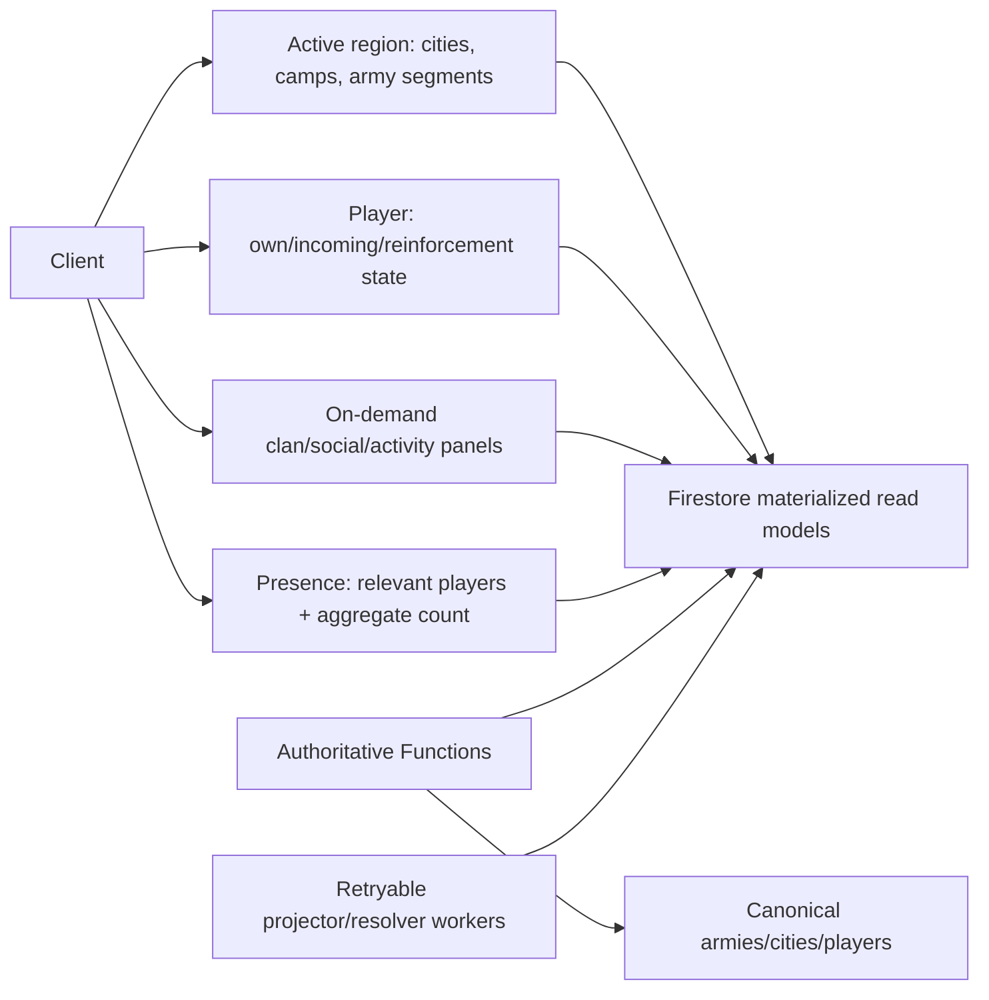

# Crownlands realtime and server-authority audit

Audit date: 2026-08-13

Audited revision: `6ce0d48` (`origin/main`)

## Conclusion

Crownlands already uses the most important scaling boundary: live world rendering is scoped to one active region, not the entire world. Region switches unsubscribe old listeners and reject late callbacks. Army orders, routes, timings, troop deductions, combat, and final resolution are server-authoritative and idempotent.

The remaining realtime risks are breadth and refresh frequency outside the map boundary. Presence can rebind a 200-document realm window every minute, realm activity keeps a 250-record global stream, and normal sessions accumulate many player, mission, report, social, and clan listeners. Those costs grow with concurrent players and activity even if adding regions does not directly add listeners.

## Active-region interest boundary

Entering a region establishes the following region-scoped streams:

| Stream | Scope | Bound | Lifecycle |
|---|---|---:|---|
| Cities | `islands/{active}/cities` | Entire region | Replaced on region switch |
| Camps | `islands/{active}/camps` | Entire region | Replaced on region switch |
| Armies | Active projection for region | Active only | Replaced on region switch |
| Presence | Realm/recent query | Limit 200 | Rebound about every 60 s |

The client increments a subscription generation on switch. Callbacks from a prior generation are ignored even if an unsubscribe races with a final snapshot. Listener errors enter a recovery state and foregrounding can restart the active-region subscription.

The city and camp queries intentionally read a whole region. That is acceptable at the present 39–103 cities and remains plausible at 100–150, provided region documents stay compact. It is not appropriate for unbounded region size. A hard region-density budget is therefore part of the data architecture, not only a rendering concern.

## Global and player-scoped streams

Gameplay adds these long-lived streams beyond the four active-region streams:

| Stream | Scope / bound | Assessment |
|---|---|---|
| Outgoing active armies | Owner UID | Correct player interest |
| Private incoming army projections | Recipient UID | Correct player interest |
| Stationed reinforcements | Contributor query | Correct player interest |
| Stationed reinforcements | Holder query | Correct player interest |
| Held camps | Collection group by holder | Correct player interest; index-dependent |
| Battle reports | Player, last 120 | Bounded but large for a live stream |
| Realm activity | Last 250 | Broad; should be topic/region scoped or paged |
| Global stats | Single document | Low cost; watch write contention |
| Crown citadel | Single document | Low cost special objective |

This gives approximately 13 base gameplay listeners. The active session player document, membership document, daily mission, and seasonal state commonly bring the total to around 17. Clan state/members, rally, social surfaces, clan quests, and applications can raise an engaged session to roughly 24–25.

The count is not automatically excessive, but every always-on stream adds reconnect reads, error paths, memory, and background work. Feature panels that are closed should use on-demand or cached point reads when realtime freshness is not necessary.

## Read amplification and hotspots

### Presence

Presence is the clearest recurring read hotspot. The client publishes approximately every 60 seconds and the realm query is also periodically rebound, potentially returning up to 200 recent documents per active player each minute. At concurrency, that becomes quadratic-like fan-out within a realm: each player can repeatedly receive many other players' documents.

Recommended shape:

- Keep one small self-presence heartbeat document per active session.
- Maintain region/realm aggregate counts through server-side sharded counters or periodic aggregation.
- Subscribe only to players relevant to the visible region, a selected social context, or direct interactions.
- Expire stale records server-side and avoid timer-driven full rebinds solely to age out local results.

### Activity and reports

Realm activity's last 250 records are global interest, not map interest. Split activity into topics such as region, clan, personal, and major-world-event. Keep a small live head (for example 20–50) and page history on demand. Reports can similarly use a small unread/live head with paged history instead of a live 120-record window.

### City synchronization

The active island subscription reads all city documents, while locally dirty owned cities are periodically synchronized at about 20 seconds. Ensure only fields that truly change are written; immutable layout belongs in versioned static region data, not repeatedly in live city documents. This separation can make a 150-city initial snapshot substantially smaller.

### Global summary documents

Single global stats or objective documents are cheap to read but can become write-contention hotspots. Any counter updated by frequent battles or captures should use sharded writes and a materialized read model rather than a transaction against one global document.

## Write cadence inventory

The runtime contains several independent periodic activities:

| Activity | Approximate cadence | Scaling concern |
|---|---:|---|
| Presence publish | 60 s | Concurrent write rate; stale cleanup |
| Presence listener refresh | 60 s | Potentially up to 200 reads/player/minute |
| App update check | 60 s | Repeated HTML/network fetch |
| Heartbeat | 60 s | Usually small, but one per session |
| Leaderboard publish | 60 s | Contention and redundant unchanged writes |
| Economy refresh | 120 s | Prefer event/server timestamp derivation |
| Owned-city dirty sync | 20 s when relevant | Must be change-only and bounded |
| Daily/seasonal/clan/reward countdowns | UI-specific | Pause when view is not active |

Coalesce minute-level housekeeping behind one visibility-aware scheduler. Use server timestamps and locally derived countdowns rather than repeated reads. Back off background tabs unless the task is necessary for correctness.

## Army command authority

### Preview

`previewArmyRoute` performs an authoritative transaction over the source, target, player profile, and stats. The server validates the deployed region/city catalog and returns the legal route and duration. Client previews remain advisory until this response.

### Send

`sendArmyOrder` validates authentication, rate limits, known city IDs, source control, available troops, target state, and route reachability. Within its transaction it deducts troops and creates an idempotent canonical order. It then materializes route-region projections and private incoming state.

This prevents client manipulation of troop counts, departure time, arrival time, or combat snapshot. The use of a stable army ID makes retries safe.

### Resolve

`resolveArmyOrderById` reads the canonical army, returns early when its state is no longer active, blocks early arrival attempts, and performs combat/economy/ownership/report changes on the server. The client can request resolution at arrival, but a scheduled function scans the canonical root army collection every minute as an offline backstop.

The scheduled scan is preferable to a collection-group search because it operates on one canonical source. Preserve bounded pagination and concurrency. Add explicit monitoring for oldest overdue active army and resolution failure rate.

### Event-authority matrix

| Event | Authority / execution | Duplicate posture |
|---|---|---|
| March creation | `sendArmyOrder` callable and Firestore transaction | Stable army/order ID and canonical existence make client retries idempotent |
| Arrival | Client may request; scheduled canonical-army scan is backstop | Resolver checks canonical `status`; concurrent client/worker attempts converge on one active→resolved transition |
| Attack / city capture | Server resolver transaction | Ownership, troops, XP/economy, reports, activity, and quest capture events are written from the authoritative outcome; retries see resolved state |
| Transfer | Server resolver transaction | Same canonical status/idempotency boundary |
| Reinforcement / return | Server callable/resolver and canonical reinforcement records | Player-scoped projections are read models; repair/cleanup must remain retry-safe |
| Rally launch/join/arrival | Server callables and army/rally transactions; routed through authoritative army resolution | More documents/participants increase transaction surface, but client does not decide combat |
| Camp capture | Server army resolution against typed camp target | Daily and clan quest progress must consume the same authoritative capture event; tests should cover all camp subtypes |
| Stronghold/Citadel capture | Server resolver plus special objective ledger/activity writes | Explicit IDs/legacy ledgers increase fan-out; prefetches and canonical army state protect the core transition |
| Scheduled Citadel NPC assault | Backend schedule creates/resolves server-owned movement | Event/wave IDs and canonical army status must be unique; monitor schedule overlap |

The key residual duplicate risk is not two clients calculating combat independently—they do not—but partial fan-out around the canonical transaction: projections, activity, notifications, quest ledgers, and repair work must all have deterministic event IDs and tolerate retries. Any work performed after a transaction commits should be queued/idempotent rather than assumed to run exactly once.

## Projection scaling

Projecting an army into each traversed region makes active-region reads efficient: clients can query the region they see. It also means write and cleanup cost are proportional to route length.

For a much larger world:

- Keep the canonical army as the sole authority.
- Materialize only regions that need to display the march, ideally the current segment plus near-future segment rather than every route region at creation.
- Give projections a canonical version/status and make deletion/repair idempotent.
- Use TTL or a repair worker for abandoned projections.
- Measure projection writes per order and cap route complexity or segment very long journeys.

A route with 20 region crossings should not require an atomic 20-region fan-out before the order is accepted. Accept the canonical order transactionally, then materialize display projections through retryable, observable work.

## Error, reconnect, and offline behavior

Army streams retry independently with backoff intervals of approximately 1, 2, 5, 10, and 30 seconds. The UI exposes reconnect state. Active-island errors mark the connection for recovery, and foregrounding can restart it. Region generations prevent stale snapshots from mutating current state.

These mechanisms are directionally correct. At scale, add:

- Jitter to retry schedules so a broad outage does not synchronize clients.
- A per-stream state machine with last-success timestamp and retry count in diagnostics.
- Snapshot/cache age in UI state so offline data is distinguishable from fresh data.
- Server metrics for listener-denied/index errors and callable failure classes.
- Emulator tests that switch regions during delayed snapshots and intermittent disconnects.

## Security and index posture

The repository's Firestore rules and index validators passed during this audit, as did realtime health and live-subscription-scope validators. That supports the intended query shapes. These validators should remain blocking gates whenever a listener, compound filter, collection-group query, or projection schema changes.

Server catalog validation is currently based on `functions/world-layout.json` embedded at deployment. It is safe against unknown client IDs but operationally static. Dynamic activation must not replace it with blind trust in client-supplied region data. Cloud Functions should read a signed/versioned active catalog or a server-controlled materialized catalog and cache it with version-aware invalidation.

## Target architecture

## Recommendations in priority order

1. Stop minute-by-minute rebinding of a 200-record presence window; introduce scoped presence and aggregates.
2. Replace the global 250-record live activity feed and 120-report live window with small live heads plus pagination.
3. Subscribe clan/social/application views only while open or while an unread indicator needs a small summary stream.
4. Separate immutable city layout from mutable live city state to reduce active-region snapshot size.
5. Add jittered reconnects and per-stream freshness diagnostics.
6. Track reads, writes, listener count, projection fan-out, overdue armies, and callable latency by release.
7. Segment long-route projections and make materialization asynchronous and repairable when the graph grows.
8. Keep all army and capture authority on the server; never move combat resolution into client or generated map data.

See [DYNAMIC_REGION_READINESS.md](./DYNAMIC_REGION_READINESS.md) for the region catalog boundary and [MAP_GENERATOR_PLAN.md](./MAP_GENERATOR_PLAN.md) for how generated layouts enter that trusted boundary.
