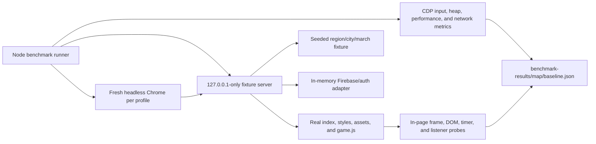

# Phase 0 authenticated map benchmark plan

Date: 2026-08-13

Audited revision at start: `6ce0d48`

## Purpose

Phase 0 measures the current authenticated Crownlands map runtime before any scaling architecture or production optimization work. It establishes deterministic fixtures, repeatable interactions, machine-readable evidence, and initial regression budgets.

This phase does not add dynamic region generation, split the world catalog, change spawning, scope presence feeds, add semantic LOD, bound caches, or alter production gameplay.

## Architecture

The server transforms served content only in memory. It serves the real Crownlands client and appends benchmark instrumentation to the served copy of `game.js`, where it can exercise the same private state and functions as normal gameplay. Production source files do not contain the benchmark API.

The server binds only to `127.0.0.1` and rejects non-loopback `Host` headers. The browser adapter is also gated by the loopback hostname. It exposes an authenticated-equivalent player, realm membership, region snapshots, player streams, and listener lifecycle without contacting Firebase.

## Deterministic fixture

The fixed seed is `crownlands-map-phase-0-v1`. The fixture clock starts at `2040-01-01T12:00:00.000Z` and advances with browser performance time.

The primary region is `region_11`; the switch target is neighboring `region_6`. Seeded city generation fixes grid positions, ownership, levels, troop counts, labels, and two camp records. March IDs, source/target choices, paths, ownership, types, troops, launch times, and arrival times are generated from the scenario. March arrival times are six hours beyond the fixed epoch so even a heavily throttled run retains its intended active set.

The first N city definitions are nested: scenario A's 50 cities are the same first 50 used by B/D and C. Repeated `createFixture()` calls are deep-equal, which the benchmark validator enforces.

| Scenario | Purpose | Cities | Active marches |
|---|---|---:|---:|
| A — Moderate | Current representative animated load | 50 | 25 |
| B — Busy | Larger combined city and march surface | 100 | 50 |
| C — Heavy | Proposed upper regional load | 150 | 100 |
| D — Static world | Isolate city/static DOM cost | 100 | 0 |
| E — March pressure | Isolate high march pressure at lower city count | 50 | 100 |

## Profiles

| Profile | Viewport | CPU |
|---|---:|---|
| Desktop | 1,440 × 900 | Native host scheduling |
| Mobile landscape | 844 × 390 | Native host scheduling; Chrome device-metric emulation |
| Mobile landscape 4× | 844 × 390 | Chrome DevTools 4× CPU slowdown |

All profiles use headless Chromium with GPU support left enabled. Mobile and CPU settings are emulations, not physical-device results. Every scenario/profile runs in a fresh Chrome process and temporary browser profile to prevent heap, cache, and CPU-throttle carryover.

## Interaction sequence

After the authenticated-equivalent fixture reports ready, the runner verifies exact scenario city/march counts and captures an initial runtime snapshot. It then performs:

1. Ten seconds of idle map animation with marches active.
2. Five seconds of continuous real pointer-drag panning.
3. Five seconds of alternating real wheel zoom.
4. Deterministic selection of five cities, opening and closing City Info for each.
5. A real switch to `region_6`, transition settlement, and return to `region_11`.

Input sequences are wall-clock bounded. This prevents a busy renderer from accumulating hundreds of queued CDP input events and converting a five-second gesture into an unbounded run.

## Measurements

The JSON records:

- Total DOM and map-world DOM nodes; city, camp, label, march, SVG, path, and VFX nodes.
- Visible city/camp/march nodes.
- Running CSS/Web Animations, the persistent application `requestAnimationFrame` loop, pending frames, timeouts, and intervals.
- Frame count, FPS, median, p95 and maximum frame duration, plus Long Tasks for every interaction sample.
- Browser main-thread task, script, style-recalculation, and layout duration/count deltas.
- Active logical listeners, category counts, duplicates, subscribe/unsubscribe lifecycle, logical document deliveries, and adapter writes.
- Runtime heap, browser performance heap counters, decoded image-memory estimate, image dimensions, request counts, bytes, resource types, external hosts, and map-image requests.
- Initial region-ready latency and both legs of the region-switch round trip.

Stable headless CDP does not expose defensible aggregate paint/composite duration counters. Those metrics are explicitly unavailable. Image memory is a decoded RGBA estimate for loaded unique `` resources, not total GPU/process/cache memory. The mock adapter measures logical realtime behavior; it does not claim real Firestore bytes, billing reads, or server latency.

## Failure policy

Normal profiles have a 240-second isolated-run watchdog; 4× profiles have 180 seconds. A profile that cannot become ready or complete the workflow is stored under `failures` and counts as a performance-budget failure. The runner does not invent missing FPS or latency values.

After each profile, `baseline.partial.json` checkpoints progress. A restarted full run resumes completed profiles and recorded failures. A successful matrix writes the final JSON and Markdown and removes the partial checkpoint.

## Production-safety boundary

- No real account, player record, Firebase emulator export, or production data is used.
- `firebaseClient.js`, normal auth flow, Firebase configuration, functions, rules, and gameplay source are unchanged.
- Service-worker registration is disabled only in the loopback-served in-memory copy.
- The mock implements local telemetry/no-op persistence and makes zero Firebase backend requests.
- Benchmark code lives under `tools/map-benchmark/` and is reached only through explicit development commands.
- `validate:map-benchmark` verifies fixed counts, deterministic deep equality, loopback gates, and absence of benchmark markers in production `game.js`.
