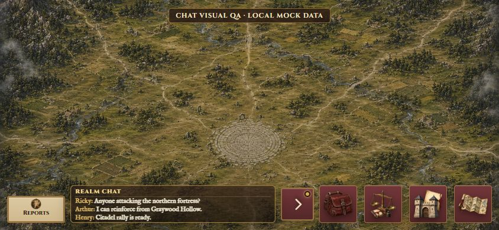
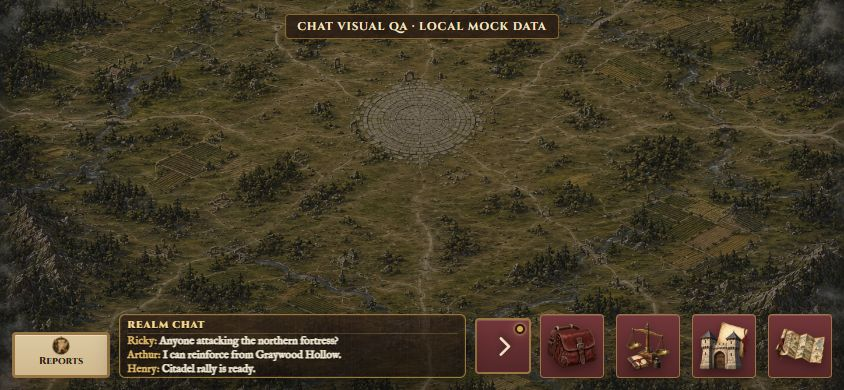
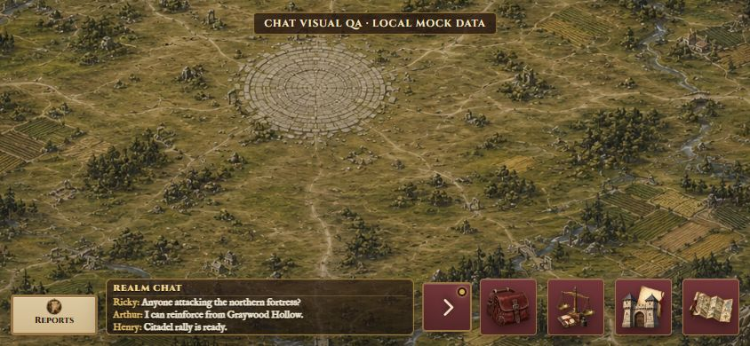
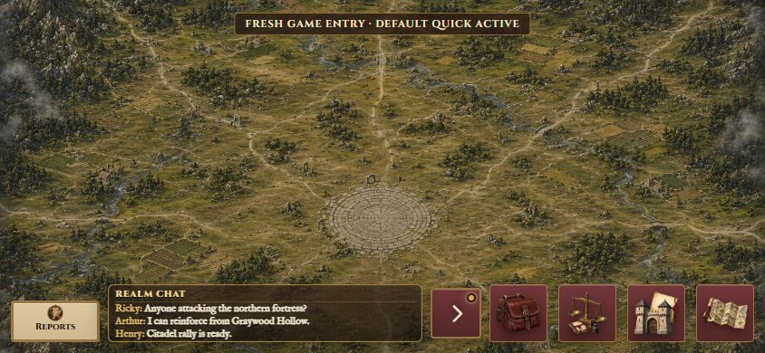
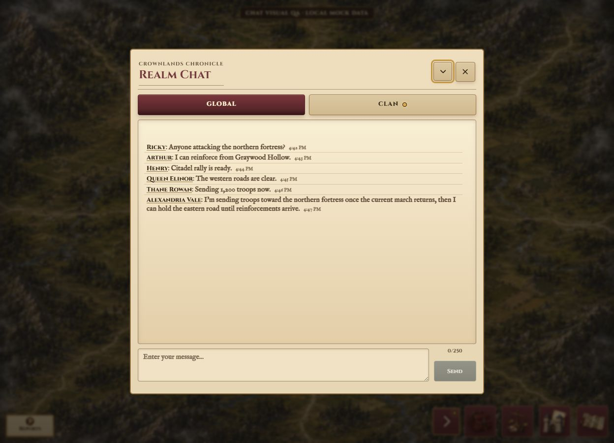
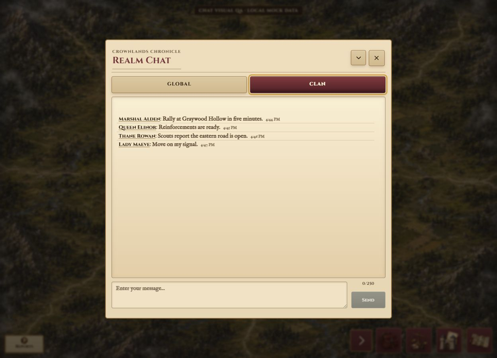
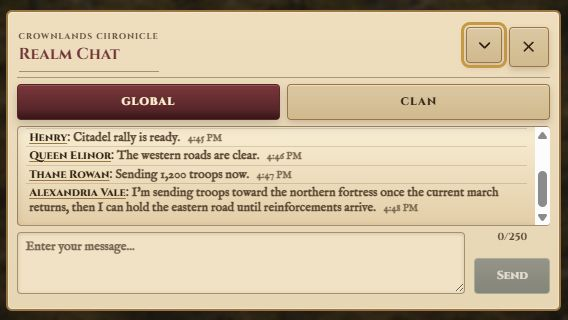
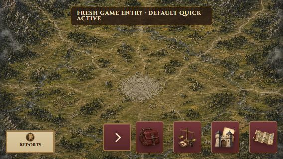
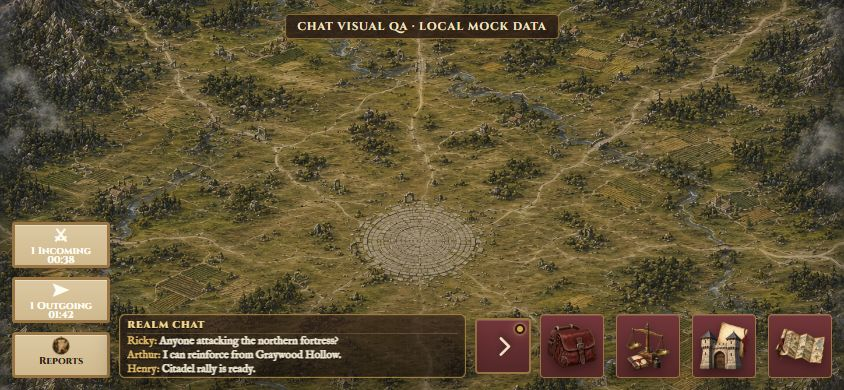

# Default Quick, Transparent Quick Peek, and Compact Rows QA

Date: 2026-08-19

Branch: `codex/chat-compact-message-rows`

Base: `4cbb0e3f581c476da42b2953116d0cf602cc90af` (`origin/main` after PR #140 had already merged and deployed)

This is an isolated client UX follow-up to the previously released Chat and movement-stack work. The QA was completed locally before publication; no merge, deployment, or production change was part of this pass.

## Compact rendering

- Quick Peek, Full Global, and Full Clan use the approved inline `PlayerName: message` presentation.
- Full Chat keeps sender, colon, message, and secondary timestamp in one compact line flow. Long text wraps naturally.
- Sender names remain buttons and dispatch the existing player-profile action; the Ricky QA row resolved to profile UID `ricky`.
- Message content still uses `textContent`; no chat-authored HTML is injected.
- Full Chat content-to-content spacing measured `3.53px` across all six Global rows.
- Quick Peek row gaps measured `2.23px`.

## Rendered transparency audit

- Computed Quick Peek surface: `linear-gradient(rgba(49, 33, 23, 0.72), rgba(22, 16, 12, 0.72))` plus the existing `0.043` texture line.
- Computed component opacity: `1`.
- Computed `backdrop-filter`: `none`.
- `::before` and `::after`: transparent background, no background image, opacity `1`.
- Every Quick Peek child: transparent background, no background image, opacity `1`.
- Message text: opaque `rgb(241, 231, 208)`, opacity `1`, with a restrained one-pixel dark text shadow for terrain readability.
- Full Chat remains opaque through its existing solid parchment gradient and opacity `1`.

## Default mode and lifecycle

- The controller records the authenticated session UID. Its first valid `start`, or a changed UID, initializes logical mode to `quick` exactly once.
- Same-session `start` calls, map changes, layout/HUD events, and transient subscription teardown do not reapply the default.
- Auth sign-out passes `{ resetSession: true }`, clearing the session marker; the next authenticated gameplay start defaults to Quick again.
- Manual close remained closed through map change, Incoming, Outgoing, an unrelated modal, HUD reconstruction, and reconnect.
- Manual Quick remained open through map change. Full Global, Clan switching, and Minimize returned to Quick.
- Five repeated new-session / Quick / Full / Minimize / map / movement / close / reconnect cycles ended with exactly one active Global and one active Clan subscription, three unique Quick rows, zero cooldown timers, zero observers, and no DOM accumulation.

## Responsive and movement QA

- 844x390: Quick Peek `347x64`, Chat `(475,318) 56x56`, Bag `(540,314) 64x64`, nine-pixel Quick/Chat and Chat/Bag gaps, and zero page overflow.
- With Incoming and Outgoing active, Quick Peek remained `347px` wide. Movement stayed above Reports at `(12,222)`, `(12,277)`, and `(12,332)` respectively.
- One-, two-, and three-message Quick states rendered exactly one, two, and three rows.
- Rapid incoming QA rendered three ordered, unique updates without duplicate rows or overflow.
- 568x320 fresh entry: logical mode `quick`, toggle `aria-expanded=true`, only `79px` available, collision suppression active, message limit `0`, and zero page overflow. The 160px readability floor was not changed.
- 568x320 Full Global: the long Alexandria Vale message wrapped to two lines with `scrollWidth === clientWidth` (`494px`) and no clipping.
- Browser console warnings/errors: `0`.

## Complete validation

- `pnpm run gate:release`: passed.
- Focused Chat validator, Functions lint, complete repository tests, HUD/mobile validator, movement tests, dependency audit, release checks: passed.
- Firebase emulator suite: all `18/18` automatically discovered gates passed, including the complete Chat security/cooldown/retention gate.
- Server route parity: 1,050 cities, 15 maps, 1,050 local routes, 1,050 per-city cross-map routes, 210 directed map chains in 166.13s.
- Production build: 257 files, 21.77 MiB.
- Production artifact validation: 258 files, 21.79 MiB.
- Dependency audit: no known vulnerabilities.
- `git diff --check`: passed.

## Screenshots

1. 
2. 
3. 
4. 
5. 
6. 
7. 
8. 
9. 
