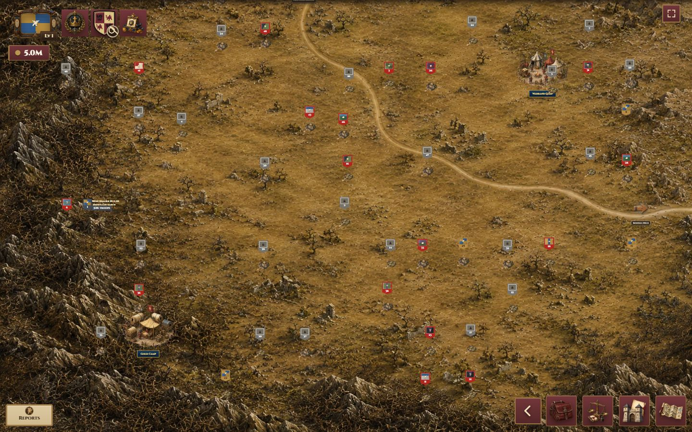
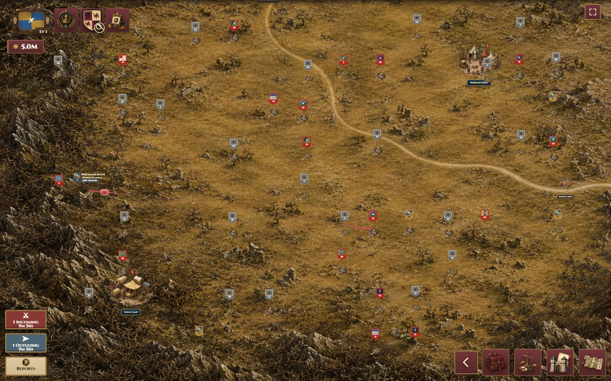
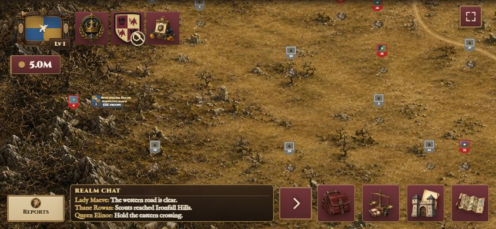
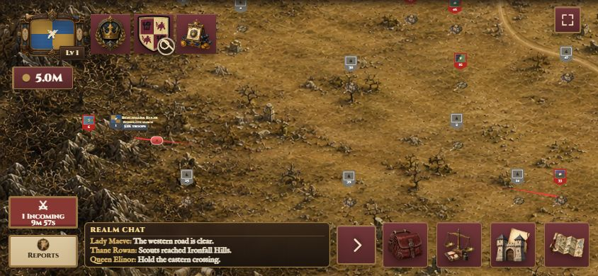
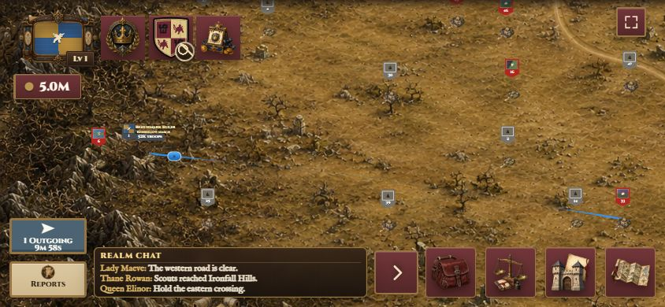
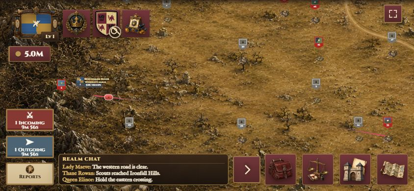
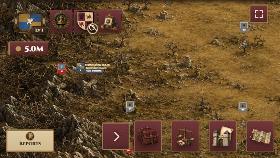
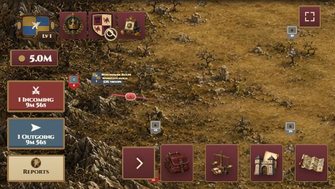

# HUD movement stack visual QA

Date: 2026-08-19

Branch: `codex/hud-movement-stack`

Base production commit: `8d580e333634022a4f91af24ee2b3096e9393128`

## Method

Screenshots were captured from the loopback Crownlands map benchmark runtime. This runtime loads the production `index.html`, styles, `game.js`, HUD layout runtime, and Chat controller. Its loopback-only Firebase adapter supplies deterministic messages and movement snapshots. Incoming and Outgoing visibility is produced through the real army normalization, operation detection, and HUD render functions; the screenshots do not toggle the buttons directly.

## Geometry

At 844×390, before this fix, the production-commit visual baseline was:

| Control | Reports only | Incoming + Outgoing |
| --- | --- | --- |
| Reports | `(12, 332) 98×46` | `(12, 332) 98×46` |
| Chat | `(475, 318) 56×56` | `(475, 318) 56×56` |
| Bag | `(540, 314) 64×64` | `(540, 314) 64×64` |
| Quick Peek | `(119, 314) 347×64` | suppressed; 139px available |

After this fix, the 844×390 geometry is:

| State | Incoming | Outgoing | Reports | Chat | Bag | Quick Peek |
| --- | --- | --- | --- | --- | --- | --- |
| Reports only | hidden | hidden | `(12, 332) 98×46` | `(475, 318) 56×56` | `(540, 314) 64×64` | `(119, 314) 347×64` |
| Incoming | `(12, 277) 98×46` | hidden | unchanged | unchanged | unchanged | `(119, 314) 347×64` |
| Outgoing | hidden | `(12, 277) 98×46` | unchanged | unchanged | unchanged | `(119, 314) 347×64` |
| Both | `(12, 222) 98×46` | `(12, 277) 98×46` | unchanged | unchanged | unchanged | `(119, 314) 347×64` |

The stack uses a 9px vertical gap. Reports remains the bottom anchor.

At 568×320, Reports remains `(12, 262) 98×46`. The responsive shared button rule keeps active movement buttons at `98×54`: a single movement button is at `(12, 199)`, while the both-active state places Incoming at `(12, 136)` and Outgoing at `(12, 199)`. Chat remains `(207, 248) 56×56`; Bag remains at its existing responsive rectangle `(272, 244) 56×64`. Quick Peek is logically open but collision-suppressed in every state because only 79px is available between permanent Reports and Chat geometry. Movement state does not change that result.

At 1440×900, Reports is `(12, 842) 98×46`. With both movements active, Incoming is `(12, 732) 98×46` and Outgoing is `(12, 787) 98×46`.

## Interaction and lifecycle results

- Center hit-tests resolved to Incoming, Outgoing, Reports, Chat, and Bag respectively.
- The former horizontal movement positions resolve to Quick Peek when it is open, never to hidden movement buttons.
- Six complete transition cycles produced 72 passing state checks.
- Global listeners remained 1 and Clan listeners remained 1 throughout.
- Each of Reports, Incoming, and Outgoing remained a single DOM node.
- Horizontal and vertical overflow remained zero.
- The viewport shell remained at scroll position zero through Full Chat, minimize, close, and reopen.
- Browser console errors and warnings: none.

## Screenshots

1. 
2. 
3. 
4. 
5. 
6. 
7. 
8. 
9. 
