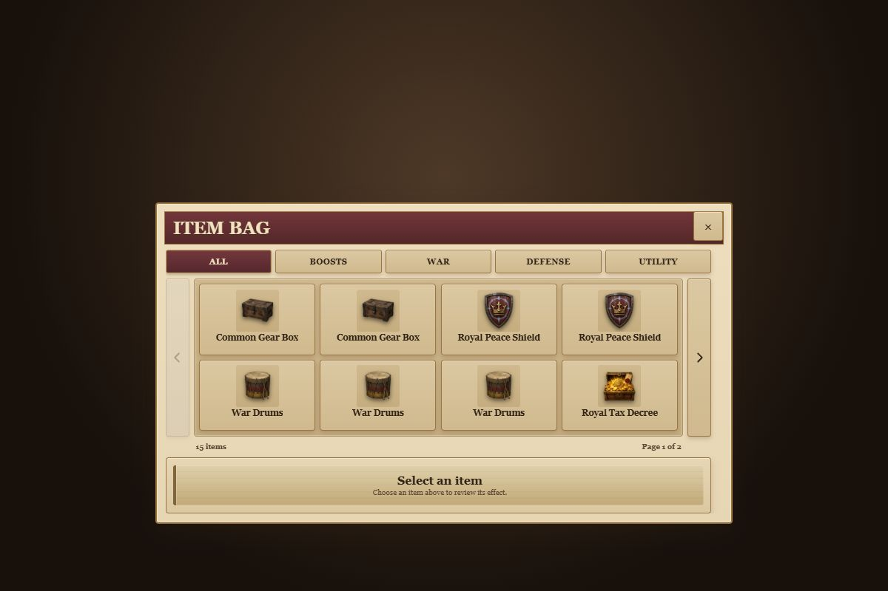

# Item Bag visual QA

This fixture uses the production Crownlands stylesheet cascade and the seven real Bag item types and optimized assets. Counts are expanded into individual presentation cards; the fixture does not invent Gold Boost or Troop Boost inventory records. The final theme pass uses the current scalable Shop fixture as its palette reference.

Required capture states:

- Desktop: All, selected Royal Peace Shield, actual Boosts category, and All page 2.
- 844×390: All page 1, All page 2, selected Royal Peace Shield, and Boosts.
- 540×320: selected Royal Peace Shield.

The fixture is visual-only. Authoritative consumption, timers, and projected-count behavior are covered by runtime validators and Firebase emulator tests.

## Verified results

- Desktop 1200×800: eight visible cards, no document or modal overflow.
- Landscape 844×390: eight visible cards, modal bottom 387.2px, selected panel bottom 379.6px, no document or modal overflow.
- Landscape 540×320: eight visible cards, modal bottom 317.2px, selected panel bottom 309.6px, Use button fully visible, no document or modal overflow.
- Unselected cards now render the Shop's exact tan gradient (`#dbc8a2` to `#d0b98e`) with dark-brown text and brass borders.
- Selected cards use the Shop's parchment highlight, restrained gold border, and burgundy inset outline; there is no blue aura or large glow.
- Paging arrows use the same parchment/tan, dark-brown, and brass button language as the Shop close and purchase controls.
- Page 2 contains the seven remaining cards with no artificial empty slots and clears the hidden selection.
- Boosts contains three War Drums and two Royal Tax Decrees as individual presentation cards.
- Arrow-key category navigation changes the selected tab and restores focus to the newly rendered tab.
- Keyboard paging restores focus to the carousel viewport. Arrow clicks and category switching remained functional at every target size.
- Browser console: no page-origin warnings or errors. Chrome-extension diagnostics were excluded from the application result.
- Runtime validators cover swipe/wheel guards, optimistic projected use, timer projection, rapid-use queuing, rejection rollback, and authoritative reopen/refresh behavior.
- Scalable Shop pricing validation, economy concurrency, and the server-authoritative Shop pricing emulator gate passed without pricing or purchase changes.
- Full static/release gate passed, including lint, 1,185-city/20-map route parity, production build/artifact checks, cache delivery, and asset budgets.
- All 23 Firebase emulator gates passed.

## Shop palette comparison

| Current scalable Shop | Final themed Item Bag |
| --- | --- |
|  |  |

## Captures

| Viewport | State | Screenshot |
| --- | --- | --- |
| 1200×800 | All | `screenshots/theme-desktop-all.png` |
| 1200×800 | Royal Peace Shield selected | `screenshots/theme-desktop-peace-shield.png` |
| 1200×800 | All, page 2 | `screenshots/theme-desktop-page-2.png` |
| 1200×800 | Boosts | `screenshots/desktop-boosts.png` |
| 844×390 | All | `screenshots/theme-landscape-844-all.png` |
| 844×390 | Royal Peace Shield selected | `screenshots/theme-landscape-844-peace-shield.png` |
| 844×390 | All, page 2 | `screenshots/theme-landscape-844-page-2.png` |
| 844×390 | Boosts | `screenshots/landscape-844-boosts.png` |
| 540×320 | Royal Peace Shield selected | `screenshots/theme-landscape-540-selected.png` |
