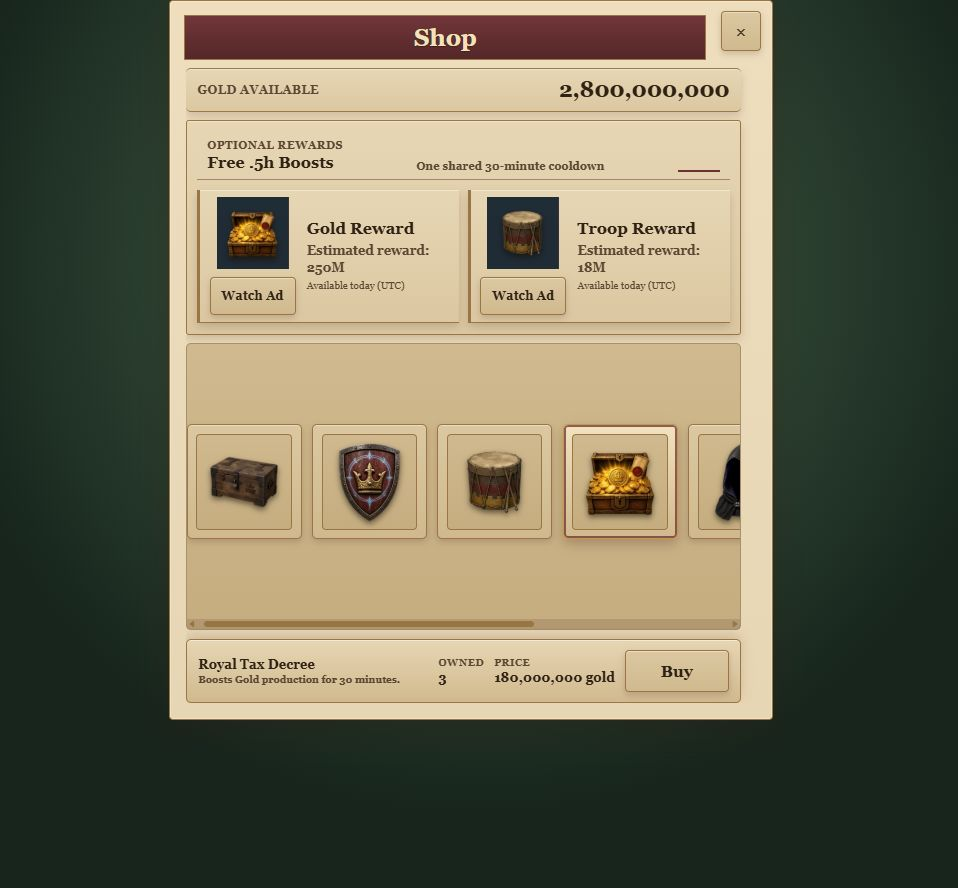
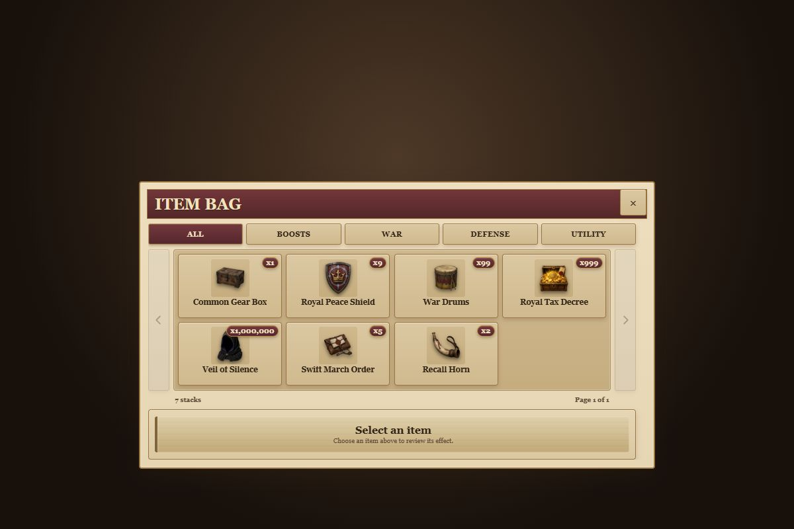

# Item Bag visual QA

This fixture uses the production Crownlands stylesheet cascade and the seven real Bag item IDs and optimized assets. Each authoritative item ID renders once with its owned count as `xN`; the fixture does not invent Gold Boost, Troop Boost, or variant inventory records. The final theme pass uses the current scalable Shop fixture as its palette reference.

Required capture states:

- Desktop: All, selected Royal Peace Shield, and actual Boosts category.
- 844×390: All, selected Royal Peace Shield, and Boosts.
- 540×320: selected Royal Peace Shield.

The fixture is visual-only. Authoritative consumption, timers, and projected-count behavior are covered by runtime validators and Firebase emulator tests.

## Verified results

- Desktop 1200×800: seven unique stack cards, no document or modal overflow.
- Landscape 844×390: seven unique stack cards; modal bottom 387.2px and selected panel bottom 379.6px, with no document overflow.
- Landscape 540×320: seven unique stack cards; modal bottom 317.2px, selected panel bottom 309.6px, and Use button bottom 296.6px, with no document overflow.
- Unselected cards now render the Shop's exact tan gradient (`#dbc8a2` to `#d0b98e`) with dark-brown text and brass borders.
- Selected cards use the Shop's parchment highlight, restrained gold border, and burgundy inset outline; there is no blue aura or large glow.
- Paging arrows use the same parchment/tan, dark-brown, and brass button language as the Shop close and purchase controls.
- The real seven-item inventory remains on one page regardless of total copy count; synthetic model coverage verifies 9 unique types page as 8 + 1.
- Boosts contains one War Drums stack and one Royal Tax Decree stack with exact quantities.
- Quantity badges cover `x1`, `x9`, `x99`, `x999`, and the realistic stress value `x1,000,000` without shifting card layout.
- At 540×320, badges compute to 8.32px bold warm-ivory text on burgundy and none report horizontal or vertical clipping.
- Arrow-key category navigation changes the selected tab and restores focus to the newly rendered tab.
- Keyboard paging restores focus to the carousel viewport. Arrow clicks and category switching remained functional at every target size.
- Browser console: no page-origin warnings or errors. Chrome-extension diagnostics were excluded from the application result.
- Runtime validators cover swipe/wheel guards, optimistic projected use, timer projection, rapid-use queuing, rejection rollback, and authoritative reopen/refresh behavior.
- Scalable Shop pricing validation, economy concurrency, and the server-authoritative Shop pricing emulator gate passed without pricing or purchase changes.
- Full static/release gate passed, including lint, 1,185-city/20-map route parity, production build/artifact checks, cache delivery, and asset budgets.
- All 23 Firebase emulator gates passed.

## Shop palette comparison

| Current scalable Shop | Stacked Item Bag |
| --- | --- |
|  |  |

## Captures

| Viewport | State | Screenshot |
| --- | --- | --- |
| 1200×800 | All / badge stress values | `screenshots/stack-desktop-all.png` |
| 1200×800 | Royal Peace Shield selected | `screenshots/stack-desktop-selected.png` |
| 844×390 | All / badge stress values | `screenshots/stack-landscape-844-all.png` |
| 844×390 | Royal Peace Shield selected | `screenshots/stack-landscape-844-selected.png` |
| 540×320 | All / badge stress values | `screenshots/stack-landscape-540-all.png` |
| 540×320 | Royal Peace Shield selected | `screenshots/stack-landscape-540-selected.png` |
